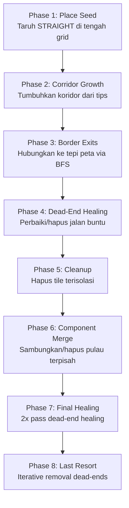

# Penjelasan Algoritma — Seruni Map Generator

Project ini terdiri dari dua file:
- **[gen.py](file:///c:/HOLDER/KULIAH/Semester%204/Grafkom/again%20and%20again/gen.py)** — Procedural map generation (logika pembuatan peta)
- **[test.py](file:///c:/HOLDER/KULIAH/Semester%204/Grafkom/again%20and%20again/test.py)** — Rendering & visualisasi dengan Pygame

---

## 1. Port-Based Tile System (Constraint Satisfaction)

**Lokasi:** [gen.py L8-29](file:///c:/HOLDER/KULIAH/Semester%204/Grafkom/again%20and%20again/gen.py#L8-L29), [gen.py L83-128](file:///c:/HOLDER/KULIAH/Semester%204/Grafkom/again%20and%20again/gen.py#L83-L128)

### Konsep
Setiap tile punya **port** (lubang koneksi) di 4 sisi: `N=0, E=1, S=2, W=3`. Dua tile bisa terhubung jika port saling berhadapan (N↔S, E↔W).

```
Contoh STRAIGHT rot=0:       Contoh CURVE rot=0:
     [Port N]                    [Port N]
        |                           |
   ─────┼─────                 ─────┘
        |                        [Port E] →
     [Port S]
```

### Cara kerja `_neighbor_constraints()`
1. Cek semua 4 tetangga dari sebuah cell
2. Untuk setiap tetangga yang sudah ada tile-nya, catat: **"apakah tetangga ini butuh koneksi ke arah kita?"**
3. Hasilnya adalah dictionary `{direction: True/False}`

### Cara kerja `_get_valid_options()`
1. Ambil constraint dari tetangga
2. Loop semua kemungkinan tile type + rotation
3. Cek apakah port tile cocok dengan semua constraint
4. Return hanya yang valid → ini adalah **Constraint Satisfaction Problem (CSP)** sederhana

> [!TIP]
> 🔍 **Judul pencarian:** "Constraint Satisfaction Problem tile-based procedural generation", "Wang Tiles procedural generation"

---

## 2. Corridor Snake Growth Algorithm

**Lokasi:** [gen.py L274-359](file:///c:/HOLDER/KULIAH/Semester%204/Grafkom/again%20and%20again/gen.py#L274-L359)

### Konsep
Algoritma utama pembuat jalan. Mirip **snake/worm** yang "merayap" dan berbelok secara organik.

### Langkah-langkah:
1. **Mulai** dari posisi & arah tertentu
2. **Setiap langkah:**
   - Hitung posisi berikutnya berdasarkan arah saat ini
   - Jika keluar grid → berhenti
   - Jika ketemu jalan existing → sambungkan (upgrade port) lalu berhenti
   - Jika sudah lurus `turn_after` langkah (2-4 tiles) → belok kiri/kanan (random)
3. **Cari tile** yang punya port masuk (`incoming`) dan keluar (`outgoing`) yang sesuai
4. **Anti-cluster check:** jika tile yang akan dipasang adalah T-junction/Cross DAN sudah ada intersection di sebelahnya → tolak, cari tile lebih sederhana
5. **Place tile**, lalu maju ke posisi baru

### Pseudocode sederhana:
```
snake(start, direction):
    posisi = start
    arah = direction
    lurus = 0
    belok_setelah = random(2, 4)
    
    for setiap langkah:
        next = posisi + arah
        if next di luar grid: STOP
        if next sudah ada jalan: SAMBUNGKAN, STOP
        
        if lurus >= belok_setelah:
            arah = belok kiri/kanan (random)
            lurus = 0
        
        pasang tile di next
        posisi = next
        lurus += 1
```

> [!TIP]
> 🔍 **Judul pencarian:** "Drunkard's Walk procedural generation", "Random Walk maze generation algorithm", "Corridor-based dungeon generation"

---

## 3. BFS (Breadth-First Search) Pathfinding

**Lokasi:** [gen.py L207-225](file:///c:/HOLDER/KULIAH/Semester%204/Grafkom/again%20and%20again/gen.py#L207-L225)

### Konsep
BFS digunakan untuk mencari **jalur terpendek** dari satu titik ke sekumpulan target melalui cell kosong.

### Cara kerja `_bfs_path_to_target()`:
1. Mulai dari `(start_c, start_r)`, masukkan ke queue
2. Ambil elemen terdepan dari queue
3. Jika posisi saat ini ada di `targets` → return path
4. Cek 4 arah (N, E, S, W):
   - Jika tetangga EMPTY atau termasuk target → tambah ke queue
5. Ulangi sampai queue kosong (tidak ada jalur) atau target ditemukan

### Digunakan untuk:
- **Menghubungkan border exit** ke jaringan jalan existing (Phase 3)
- **Dead-end healing** — mencari jalur dari dead-end ke jalan terdekat
- **Menyambung komponen terpisah** (Phase 5)

> [!TIP]
> 🔍 **Judul pencarian:** "Breadth-First Search algorithm", "BFS shortest path grid"

---

## 4. Flood Fill (Connected Component Detection)

**Lokasi:** [gen.py L168-186](file:///c:/HOLDER/KULIAH/Semester%204/Grafkom/again%20and%20again/gen.py#L168-L186)

### Konsep
Flood fill digunakan untuk menemukan semua tile jalan yang **terhubung** satu sama lain, mirip fitur "paint bucket" di aplikasi gambar.

### Cara kerja `_flood_fill()`:
1. Mulai dari satu tile jalan
2. Masukkan ke queue (BFS) dan set `visited`
3. Untuk setiap tile, cek port-nya → jika port mengarah ke tetangga yang juga punya port balik → tambahkan ke visited
4. Return semua tile yang terhubung

### Digunakan untuk:
- **Mendeteksi komponen terpisah** — jika ada "pulau" jalan yang tidak terhubung
- **Keep largest component** — simpan jaringan terbesar, hapus atau sambungkan sisanya

> [!TIP]
> 🔍 **Judul pencarian:** "Flood Fill algorithm", "Connected Component Labeling"

---

## 5. Dead-End Healing Algorithm

**Lokasi:** [gen.py L462-548](file:///c:/HOLDER/KULIAH/Semester%204/Grafkom/again%20and%20again/gen.py#L462-L548)

### Konsep
Iterative repair algorithm yang menghapus/memperbaiki jalan buntu di interior peta.

### 4 Strategi (dijalankan berurutan):

| Prioritas | Strategi | Cara Kerja |
|-----------|----------|------------|
| 1 | **Extend to border** | BFS cari jalur ke tepi peta (max 8 langkah), lalu bangun jalan |
| 2 | **Loop to nearby road** | BFS cari jalur ke jalan terdekat (max 5 langkah), buat loop |
| 3 | **Upgrade tile** | Ganti tile dengan tipe yang punya lebih banyak koneksi |
| 4 | **Remove** | Hapus tile jika tidak bisa diperbaiki |

### Flow:
```
repeat max 15 kali:
    cari semua dead-end interior
    if tidak ada: SELESAI
    
    for setiap dead-end:
        coba strategi 1 → jika berhasil, lanjut
        coba strategi 2 → jika berhasil, lanjut
        coba strategi 3 → jika berhasil, lanjut
        strategi 4: hapus tile
```

> [!TIP]
> 🔍 **Judul pencarian:** "Dead-end removal maze algorithm", "Iterative repair procedural generation"

---

## 6. Anti-Cluster Heuristic

**Lokasi:** [gen.py L231-253](file:///c:/HOLDER/KULIAH/Semester%204/Grafkom/again%20and%20again/gen.py#L231-L253)

### Konsep
Mencegah terbentuknya **cluster intersection** (tumpukan T-junction/Cross yang berdekatan) agar peta terlihat organik.

### Cara kerja:
- `_count_nearby_intersections()` — hitung jumlah T-junction/Cross dalam radius **Manhattan Distance** tertentu
- `_has_adjacent_intersection()` — cek apakah ada intersection tepat di sebelah

**Manhattan Distance:** `|x1-x2| + |y1-y2|` (jarak tanpa diagonal)

### Digunakan saat:
- **Corridor growth:** jika tile baru akan jadi intersection DAN sudah ada intersection di sebelahnya → tolak
- **Branching:** jika dalam radius 2 sudah ada ≥1 intersection → jangan buat cabang baru

> [!TIP]
> 🔍 **Judul pencarian:** "Manhattan Distance heuristic", "Anti-clustering procedural generation"

---

## 7. Quadratic Bézier Curve (Rendering)

**Lokasi:** [test.py L191-200](file:///c:/HOLDER/KULIAH/Semester%204/Grafkom/again%20and%20again/test.py#L191-L200)

### Konsep
Kurva Bézier kuadratik digunakan untuk menggambar **tikungan jalan yang halus** (bukan kotak/sudut tajam).

### Formula Matematika:
```
B(t) = (1-t)² × P0 + 2(1-t)t × P1 + t² × P2,  dimana t ∈ [0, 1]
```

- **P0** = titik awal (port masuk)
- **P1** = titik kontrol (pusat tile → menghasilkan kurva ke dalam)
- **P2** = titik akhir (port keluar)
- **t** = parameter dari 0 sampai 1

### Visualisasi:
```
P0 (port N)
  \
   \  ← kurva melengkung ke dalam
    \
     P1 (center)
      \
       → P2 (port E)
```

### Digunakan untuk:
- **Curve tile** — tikungan 90°
- **T-junction** — 3 pasang kurva Bézier antar port
- **Cross** — 6 pasang kurva Bézier antar semua port

> [!TIP]
> 🔍 **Judul pencarian:** "Quadratic Bézier Curve", "Bézier curve computer graphics", "De Casteljau algorithm"

---

## 8. Offset Curve (Pelebaran Jalan)

**Lokasi:** [test.py L203-224](file:///c:/HOLDER/KULIAH/Semester%204/Grafkom/again%20and%20again/test.py#L203-L224)

### Konsep
Membuat **band/pita** jalan dengan lebar tertentu di sekitar garis tengah Bézier.

### Cara kerja `_offset_curve()`:
1. Untuk setiap titik pada kurva, hitung **vektor tangent** (arah kurva)
2. Hitung **vektor normal** (tegak lurus tangent) → `(-dy, dx)` untuk kiri
3. Geser titik sejauh `offset` pixel ke arah normal
4. Hasilnya: dua polyline (kiri & kanan) yang membentuk pita jalan

### `_filled_band()`:
1. Buat offset kiri dan kanan dari center curve
2. Gabungkan menjadi polygon tertutup: `kiri + reversed(kanan)`
3. Gambar polygon terisi

```
     ╔══════════╗  ← offset kiri
     ║ ROAD     ║
─────╫──────────╫───── center line (Bézier)
     ║  SURFACE ║
     ╚══════════╝  ← offset kanan
```

> [!TIP]
> 🔍 **Judul pencarian:** "Offset curve algorithm", "Parallel curve computer graphics", "Normal vector 2D curve"

---

## 9. Tile Upgrade System

**Lokasi:** [gen.py L142-165](file:///c:/HOLDER/KULIAH/Semester%204/Grafkom/again%20and%20again/gen.py#L142-L165)

### Konsep
Mengubah tile yang sudah ada menjadi tipe yang lebih kompleks untuk menambah port baru **tanpa merusak koneksi existing**.

### Contoh:
```
STRAIGHT (N-S)  →  T-JUNCTION (N-S-E)   (menambah port E)
CURVE (N-E)     →  T-JUNCTION (N-E-S)   (menambah port S)
T-JUNCTION      →  CROSS                (menambah port ke-4)
```

### Validasi:
- Port baru tidak boleh mengarah ke tetangga yang **tidak punya port balik** (menghindari koneksi satu arah)

---

## 10. Fase-Fase `generate_map()`

**Lokasi:** [gen.py L553-730](file:///c:/HOLDER/KULIAH/Semester%204/Grafkom/again%20and%20again/gen.py#L553-L730)



---

## Ringkasan Algoritma

| # | Algoritma | Tipe | File | Tujuan |
|---|-----------|------|------|--------|
| 1 | Port-Based CSP | Constraint Satisfaction | gen.py | Memastikan tile cocok dengan tetangga |
| 2 | Corridor Snake | Random Walk variant | gen.py | Membuat jaringan jalan organik |
| 3 | BFS | Graph Search | gen.py | Mencari jalur terpendek |
| 4 | Flood Fill | Graph Traversal | gen.py | Deteksi komponen terhubung |
| 5 | Dead-End Healing | Iterative Repair | gen.py | Menghilangkan jalan buntu |
| 6 | Anti-Cluster | Spatial Heuristic | gen.py | Mencegah tumpukan intersection |
| 7 | Quadratic Bézier | Parametric Curve | test.py | Rendering tikungan halus |
| 8 | Offset Curve | Computational Geometry | test.py | Membuat pita jalan berlebar |
| 9 | Tile Upgrade | Constraint-aware Mutation | gen.py | Menambah koneksi tanpa merusak |

---

## Referensi Pencarian Tambahan

Jika ingin mempelajari lebih lanjut secara mandiri:

1. **"Procedural Content Generation in Games"** — buku/artikel tentang PCG secara umum
2. **"Wave Function Collapse algorithm"** — algoritma tile-based yang lebih advanced dari CSP sederhana
3. **"Pygame tutorial road rendering"** — untuk memahami rendering 2D dengan Pygame
4. **"Random Walk procedural dungeon generation"** — dasar dari corridor growth
5. **"Bézier curve interactive tutorial"** — cari di [pomax.github.io/bezierinfo](https://pomax.github.io/bezierinfo/) untuk tutorial interaktif terlengkap
